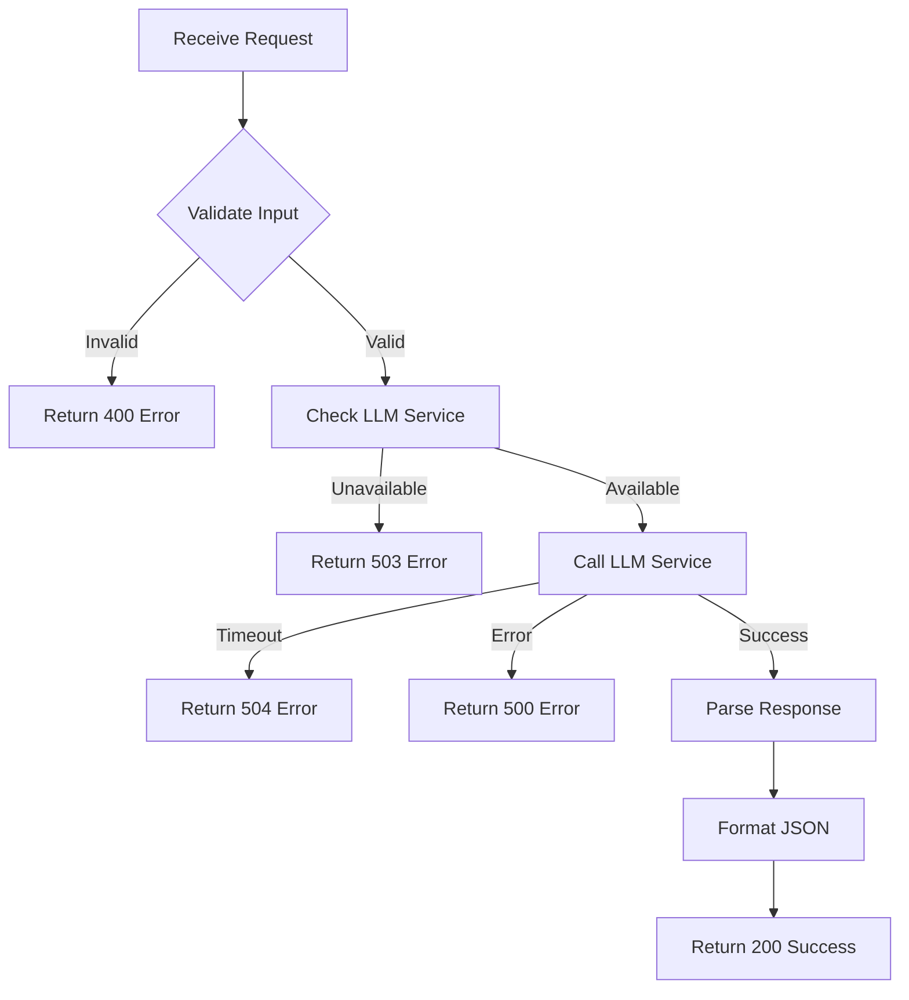

# 🌐 API Routes

> FastAPI endpoint definitions for the Sentiment Aura backend

## 📋 Overview

This module contains the API route definitions for the Sentiment Aura backend service. The routes handle incoming requests, validate data, call appropriate services, and return formatted responses.

## 📡 Main Endpoints

### `POST /process_text`

The primary endpoint for sentiment analysis and keyword extraction.

**Implementation:**
```python
@router.post("/process_text")
async def process_text(text: str):
    # 1. Validate input text
    # 2. Call LLM service for analysis
    # 3. Format and return structured response
    return structured_json
```

**Request Format:**
```json
{
  "text": "The transcribed speech text to analyze"
}
```

**Response Format:**
```json
{
  "sentiment": {
    "score": 0.85,
    "type": "positive",
    "intensity": "strong"
  },
  "keywords": ["innovation", "excited", "future", "technology"]
}
```

### Response Structure Details

#### Sentiment Object
- **score**: Float between 0 and 1
  - 0.0-0.33: Negative
  - 0.34-0.66: Neutral  
  - 0.67-1.0: Positive
  
- **type**: String enum
  - `"positive"` - Optimistic, happy, enthusiastic
  - `"negative"` - Pessimistic, sad, frustrated
  - `"neutral"` - Balanced, factual, objective
  
- **intensity**: String enum
  - `"weak"` - Mild emotional expression
  - `"moderate"` - Clear emotional tone
  - `"strong"` - Intense emotional expression

#### Keywords Array
- Extracted key terms from the text
- Maximum of 5-7 keywords
- Ordered by relevance
- Single words or short phrases
- Filtered for significance

## ⚡ Error Handling

### HTTP Status Codes

| Code | Meaning | When Returned |
|------|---------|--------------|
| 200 | Success | Analysis completed successfully |
| 400 | Bad Request | Invalid input (empty text, too long) |
| 422 | Unprocessable Entity | Request validation failed |
| 500 | Internal Server Error | LLM API call failed |
| 503 | Service Unavailable | LLM service not configured |
| 504 | Gateway Timeout | LLM response took too long |

### Error Response Format

```json
{
  "error": "Descriptive error message",
  "status_code": 400,
  "timestamp": "2024-01-15T12:00:00Z",
  "details": {
    "field": "text",
    "issue": "Text length exceeds maximum of 5000 characters"
  }
}
```

## 🔄 Request Flow



## 🛡️ Input Validation

### Text Validation Rules
- **Minimum Length**: 10 characters
- **Maximum Length**: 5000 characters
- **Character Set**: UTF-8 supported
- **Whitespace**: Stripped from beginning/end
- **Empty Check**: Pure whitespace rejected

### Sanitization
- HTML tags stripped
- Special characters preserved
- Unicode normalization applied
- Line breaks preserved

## 📊 Rate Limiting

Future implementation will include:
- Per-IP rate limiting
- API key based quotas
- Burst allowance
- Graceful degradation

## 🔐 Security Measures

### Current Implementation
- Input validation with Pydantic
- CORS configuration
- Error message sanitization
- Request size limits

### Future Enhancements
- API key authentication
- Request signing
- IP whitelisting
- DDoS protection

## 🧪 Testing the API

### Using cURL
```bash
# Basic request
curl -X POST http://localhost:8000/process_text \
  -H "Content-Type: application/json" \
  -d '{"text": "I am really excited about this new project!"}'

# With verbose output
curl -v -X POST http://localhost:8000/process_text \
  -H "Content-Type: application/json" \
  -d '{"text": "This is frustrating and not working as expected."}'
```

### Using HTTPie
```bash
http POST localhost:8000/process_text \
  text="The presentation went exceptionally well today!"
```

### Using Python
```python
import requests

response = requests.post(
    "http://localhost:8000/process_text",
    json={"text": "This is an amazing opportunity!"}
)
print(response.json())
```

## 📈 Monitoring & Metrics

### Logged Metrics
- Request count
- Response times
- Error rates
- LLM API latency
- Keywords per request

### Health Monitoring
The `/health` endpoint provides:
- Service status
- Dependency health
- Version information
- Uptime statistics

## 🔧 Configuration

### Environment Variables
```python
# API Configuration
API_TIMEOUT = 10  # seconds
MAX_TEXT_LENGTH = 5000  # characters
MIN_TEXT_LENGTH = 10  # characters
```

### Response Caching
- Cache duration: 5 minutes
- Cache key: MD5 hash of text
- Cache invalidation: Manual or TTL

## 🚀 Performance Optimizations

1. **Async Processing**: All I/O operations are async
2. **Connection Pooling**: Reuse HTTP connections
3. **Response Streaming**: For large responses
4. **Batch Processing**: Group similar requests
5. **Caching Layer**: Redis for frequent queries

## 📝 API Documentation

### Automatic Documentation
- Swagger UI: `http://localhost:8000/docs`
- ReDoc: `http://localhost:8000/redoc`
- OpenAPI JSON: `http://localhost:8000/openapi.json`

### Manual Testing
Use the Swagger UI to:
- Test endpoints interactively
- View request/response schemas
- Download API specification
- Generate client code

---

*RESTful API powering Sentiment Aura's backend services*
