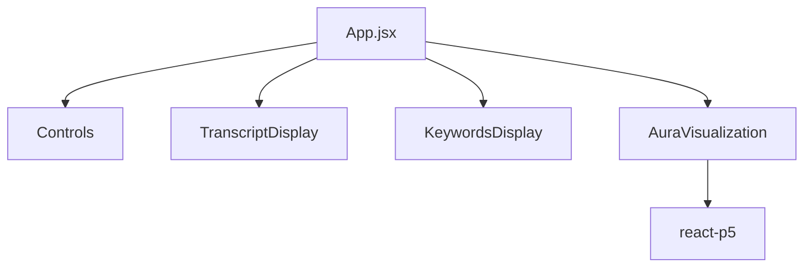

# 🧩 React Components

> UI components for the Sentiment Aura application

## 📋 Overview

This directory contains all React components that make up the user interface of Sentiment Aura. Each component is designed to be modular, reusable, and focused on a single responsibility.

## 🎨 Component Documentation

### 📜 TranscriptDisplay.jsx

**Purpose**: Displays live transcription text with auto-scrolling functionality

**Features**:
- Live, auto-scrolling transcript text display
- Semi-transparent overlay panel for better visibility
- Smooth scroll animations to latest text
- Visual distinction between interim and final transcripts

**Props**:
```javascript
{
  transcript: Array<{
    text: string,        // The transcribed text
    timestamp: string,   // ISO timestamp
    isFinal: boolean    // Whether this is a final transcript
  }>,
  isRecording: boolean  // Current recording state
}
```

**Key Implementation Details**:
- Uses `useRef` for scroll container reference
- `useEffect` triggers auto-scroll on new transcripts
- CSS transitions for smooth scrolling
- Opacity differences for interim vs final text

---

### 🔑 KeywordsDisplay.jsx

**Purpose**: Shows AI-extracted keywords with elegant animations

**Features**:
- Keywords extracted by AI from transcribed text
- **Smooth fade-in animations** (NOT instant pop-in)
- **Staggered appearance** - keywords appear one by one
- Floating animation or tag cloud layout
- Automatic cleanup of old keywords

**Props**:
```javascript
{
  keywords: Array<{
    text: string,       // The keyword
    id: number,        // Unique identifier
    delay: number      // Animation delay in ms
  }>,
  isProcessing: boolean // Loading state
}
```

**Key Feature - Graceful Animations**:
```css
/* One-by-one appearance with CSS transitions */
.keyword-item {
  opacity: 0;
  transform: translateY(20px) scale(0.8);
  animation: fadeInUp 0.6s ease-out forwards;
  animation-delay: var(--delay);
}

@keyframes fadeInUp {
  to {
    opacity: 1;
    transform: translateY(0) scale(1);
  }
}
```

---

### 🎮 Controls.jsx

**Purpose**: Recording controls with visual feedback

**Features**:
- Start/Stop recording button with clear states
- **Visual recording indicator** (pulsing red dot)
- Error state display with user-friendly messages
- Connection status indication
- Disabled state during processing

**Props**:
```javascript
{
  isRecording: boolean,         // Current recording state
  onStart: () => void,         // Start recording callback
  onStop: () => void,          // Stop recording callback
  error: string | null,        // Error message to display
  isConnected: boolean         // WebSocket connection status
}
```

**Visual States**:
- **Idle**: Blue button, "Start Recording"
- **Recording**: Red pulsing button with dot, "Stop Recording"
- **Error**: Red border with error message below
- **Disabled**: Grayed out during connection

---

### 🌌 AuraVisualization.jsx

**Purpose**: Generative art visualization using Perlin noise fields

**Features**:
- p5.js canvas component using `react-p5` wrapper
- Perlin noise field visualization
- Real-time reaction to sentiment data
- Dynamic color palettes based on emotion
- Smooth transitions between states

**Props**:
```javascript
{
  sentiment: {
    score: number,        // 0-1 sentiment score
    type: string,        // 'positive', 'negative', 'neutral'
    intensity: string    // 'weak', 'moderate', 'strong'
  } | null,
  keywords: Array<{...}>, // Keywords for additional visual elements
  isActive: boolean      // Whether visualization should be animated
}
```

**Visual Parameters Mapping**:

| Sentiment | Color Palette | Flow Speed | Noise Scale | Particle Count |
|-----------|--------------|------------|-------------|----------------|
| Positive | Warm (orange/yellow) | Fast | Large | Many |
| Negative | Cool (blue/purple) | Slow | Small | Few |
| Neutral | Balanced (green/teal) | Medium | Medium | Medium |

**Intensity Modifiers**:
- **Weak**: 50% effect strength
- **Moderate**: 75% effect strength  
- **Strong**: 100% effect strength

**Performance Optimizations**:
- Noise values calculated once per frame
- Particle pooling to avoid garbage collection
- Canvas size responsive to container
- 60fps target with `frameRate(60)`

**Reference Implementation**:
Based on techniques from [Sighack's Perlin Noise Fields](https://sighack.com/post/getting-creative-with-perlin-noise-fields)

---

## 🎯 Component Best Practices

### Styling Approach
- CSS Modules for component isolation
- BEM naming convention for class names
- CSS variables for theming
- Mobile-first responsive design

### Performance Guidelines
- Use `React.memo` for expensive renders
- Implement `shouldComponentUpdate` logic where needed
- Lazy load heavy visualizations
- Debounce rapid state updates

### Accessibility
- Proper ARIA labels on interactive elements
- Keyboard navigation support
- Screen reader friendly text
- High contrast mode support

### Error Handling
- Graceful degradation on failures
- User-friendly error messages
- Retry mechanisms where appropriate
- Error boundaries to prevent crashes

## 🧪 Testing Checklist

Each component should have tests for:
- [ ] Props validation
- [ ] User interactions
- [ ] State changes
- [ ] Error states
- [ ] Accessibility
- [ ] Responsive behavior
- [ ] Animation triggers
- [ ] Performance benchmarks

## 📁 File Structure

```
components/
├── README.md               # This file
├── TranscriptDisplay.jsx   # Live transcription viewer
├── KeywordsDisplay.jsx     # Keyword tag cloud
├── Controls.jsx           # Recording controls
└── AuraVisualization.jsx  # Perlin noise visualization
```

## 🔗 Component Dependencies



---

*Building blocks of the Sentiment Aura user interface*
